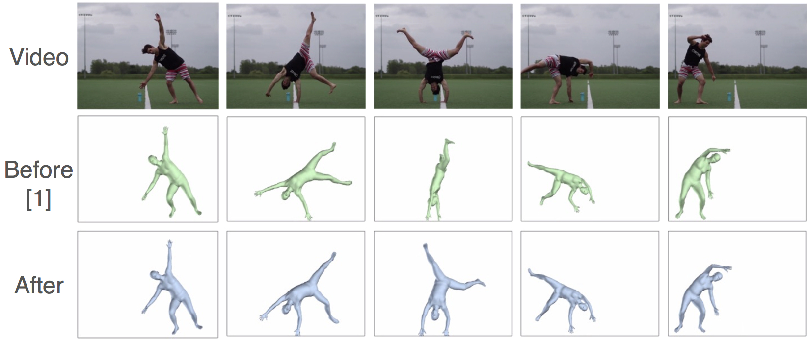

# Motion Reconstruction Code and Data for Skills from Videos (SFV)

This repo contains the data and the code for motion reconstruction component of the SFV paper:

SFV: Reinforcement Learning of Physical Skills from Videos  
Transactions on Graphics (Proc. ACM SIGGRAPH Asia 2018)  
Xue Bin Peng, Angjoo Kanazawa, Jitendra Malik, Pieter Abbeel, Sergey Levine  
University of California, Berkeley

[Project Page](https://xbpeng.github.io/projects/SFV/index.html)



## Data

The data for the video can be found in this [link](https://drive.google.com/file/d/1phHxMLztPP1t1f7_7ZWH3pXf-wUaN4u9/view?usp=sharing).   
It contains the:
- Input videos
- Intermediate 2D OpenPose, tracks, and HMR outputs
- Result video of before and after motion reconstruction
- Output of motion reconstruction in bvh used to train the character

See the README in the tar file for more details.

## Requirements
- [TensorFlow](https://www.tensorflow.org/) 
- [SMPL](http://smpl.is.tue.mpg.de/)
- Have the same `models/` structure as in [HMR](https://github.com/akanazawa/hmr/) (you need the trained models and `neutral_smpl_with_cocoplus_reg.pkl`)

## Rotation augmented models
This repo uses fine-tuned models for OpenPose and HMR with rotation
augmentation.
The models used can be found here:
[ft-OpenPose](https://drive.google.com/file/d/1lSLrZDLGY93zOw3i2V-KuhhASC9YG7ez/view?usp=sharing), [ft-HMR](https://drive.google.com/file/d/1vnAZgwS6DrEC9RNB-KsZzbPvIwJex5b2/view?usp=sharing)

## Steps to run:
1. `python -m run_openpose`

2. `python -m refine_video`

I recommend starting with the preprocessed data that's packaged with the above
link, and start from `python -m refine_video`.
Then run step 1 for your own video.

## Comments
Note this repo is more of a research code demo compared to my other project code
releases. It's also slightly dated.
I'm putting this out there in case this is useful for others. You may need to fix some quirks.

Pull requests/contributions welcome!

### License
This particular repo is under BSD but please follow the license agreement for tools that I build on such as [SMPL](http://smpl.is.tue.mpg.de/license_model) and [OpenPose](https://github.com/CMU-Perceptual-Computing-Lab/openpose/blob/master/LICENSE).


#### June 28 2019.  
In this repo, motion reconstruction smoothes HMR output. We recently released
the demo for 
[Human Mesh and Motion Recovery (HMMR)](https://github.com/akanazawa/human_dynamics),
which will give you smoother outputs. You can apply motion reconstrution on top
of the HMMR outputs, which will be a better starting point. This would probably
be the best combination of the tools out there today.

I'm also using 2D pose from [OpenPose](https://github.com/CMU-Perceptual-Computing-Lab/openpose) here and have my own hacky tracking code. However there are more recent tools such as
[AlphaPose and PoseFlow](https://github.com/MVIG-SJTU/AlphaPose/tree/pytorch/PoseFlow) that
will compute the tracklet for you. (We use this in the HMMR codebase).

Fitting the HMMR output to
[DensePose](https://github.com/MVIG-SJTU/AlphaPose/tree/pytorch/PoseFlow) output
will be another simple loss function to add to the motion reconstruction to get a good 3D body fit to a video.

All of these would be a good starter project ;)

Another practical improvements that should be made is that this uses OpenDR
renderer to render the results, which is slow and takes up most of the run
time. In HMMR we use (the pytorch
NMR)[https://github.com/daniilidis-group/neural_renderer] to render the
results. The same logic can be adapted here.


### Citation
If you use this code for your research, please consider citing:
```
@article{
	2018-TOG-SFV,
	author = {Peng, Xue Bin and Kanazawa, Angjoo and Malik, Jitendra and Abbeel, Pieter and Levine, Sergey},
	title = {SFV: Reinforcement Learning of Physical Skills from Videos},
	journal = {ACM Trans. Graph.},
	volume = {37},
	number = {6},
	month = nov,
	year = {2018},
	articleno = {178},
	numpages = {14},
	publisher = {ACM},
	address = {New York, NY, USA},
	keywords = {physics-based character animation, computer vision, video imitation, reinforcement learning, motion reconstruction}
} 
@inProceedings{kanazawaHMR18,
  title={End-to-end Recovery of Human Shape and Pose},
  author = {Angjoo Kanazawa
  and Michael J. Black
  and David W. Jacobs
  and Jitendra Malik},
  booktitle={Computer Vision and Pattern Regognition (CVPR)},
  year={2018}
}
```
